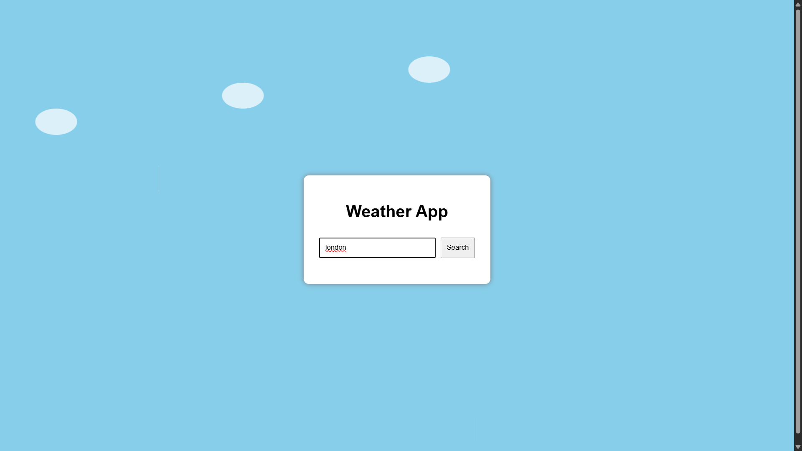
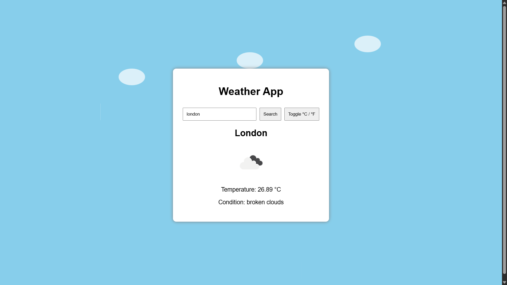

# 🌦️ 03 - Simple Web Projects: Weather App (HTML, CSS, JavaScript)


This is the third project in the **Simple Web Projects** series — a clean and functional **Weather App** built using **HTML, CSS, and vanilla JavaScript with Fetch API**.

---

## ✨ Features

- Search any city and display live weather
- Shows temperature, condition, and weather icon
- Toggle between **Celsius and Fahrenheit**
- Animated **moving clouds** and **gentle rain**
- Responsive and aesthetic layout

---

## 📸 Screenshots

### Default View


### Weather Display


---

## 🚀 Getting Started

1. **Clone this repository**
   ```bash
   git clone https://github.com/vishal-git-dot/03-simple-web-projects-html-css-js.git
   ```

2. **Navigate to the folder**
   ```bash
   cd 03-weather-app-html-css-js
   ```

3. **Replace the API Key**

   Open `script.js` and replace this line:
   ```javascript
   const apiKey = 'YOUR_API_KEY_HERE';
   ```
   with your actual key from [OpenWeatherMap](https://openweathermap.org/api).

4. **Open `index.html`** in your browser

---

## 🧠 JavaScript Concepts Used

| Concept              | Description                                       |
|----------------------|---------------------------------------------------|
| `fetch()`            | Access real-time data from OpenWeatherMap         |
| `async/await`        | Handle asynchronous API calls                     |
| `try...catch`        | Error handling for invalid city names             |
| `DOM manipulation`   | Update temperature, condition, icon               |
| `toggle state`       | Switch between Celsius and Fahrenheit             |
| `setTimeout`, `@keyframes` | Animate clouds and rain                    |

---

## 📚 Upcoming Projects in This Series

| #   | Project Name              | Skills                                   | Features                                               |
|-----|---------------------------|------------------------------------------|--------------------------------------------------------|
| ✅ 01 | To-Do List App          | DOM manipulation, event handling, localStorage | Add, edit, delete tasks; mark as completed         |
| ✅ 02 | Calculator              | JavaScript logic, CSS grid               | Basic arithmetic operations, responsive layout         |
| ✅ 03 | Weather App             | Fetch API, JSON, async/await             | Search city, display temperature and weather           |
| 🔜 04 | Digital Clock           | Date object, setInterval                 | Live time update, dark/light mode                     |
| 🔜 05 | Quiz App                | Event listeners, arrays, conditionals    | MCQs, score tracker, optional timer                    |
| 🔜 06 | Image Slider/Carousel   | DOM manipulation, CSS transitions        | Auto-slide, next/prev, indicators                      |
| 🔜 07 | Portfolio Website       | Responsive design, layout                | About, Projects, Contact sections                      |
| 🔜 08 | Typing Speed Test       | Timers, string comparison, DOM updates   | Random text, live WPM, accuracy                        |
| 🔜 09 | Notes App               | localStorage, event handling             | Add/delete notes, save data across sessions            |
| 🔜 10 | Rock, Paper, Scissors   | Random logic, conditionals               | Play vs. computer, show result, track score            |

---

## 🛠️ Built With

- [HTML5](https://developer.mozilla.org/en-US/docs/Web/Guide/HTML/HTML5) — semantic markup  
- [CSS3](https://developer.mozilla.org/en-US/docs/Web/CSS) — animations, layout, effects  
- [JavaScript](https://developer.mozilla.org/en-US/docs/Web/JavaScript) — async API, DOM manipulation  

---

## 🤝 Contributing

Contributions are welcome! Fork the repo, make changes, and open a pull request.

If you found this project helpful, consider giving it a ⭐ on GitHub!

---

Made with ☁️ + ☔ as part of a self-learning journey.
